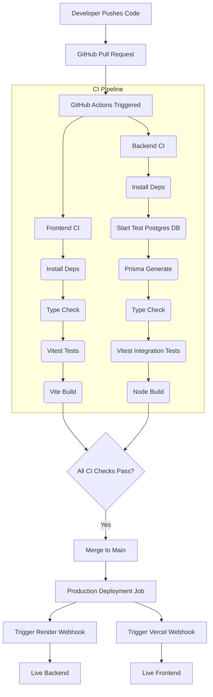

# 🚀 Wholesale ERP/CRM Operations Portal

A production-ready, full-stack **Wholesale & Distribution ERP / CRM System** built with **Node.js, Express, TypeScript, Prisma ORM, PostgreSQL**, and **React (Vite + Tailwind CSS)**.

> 🌟 **[Click here to view the Live Demo Guide & Evaluator Walkthrough](./DEMO_GUIDE.md)** for live application links, test credentials, and a step-by-step feature showcase!

---

## 🌐 Live Demo & Deployment Links

> [!IMPORTANT]  
> **Paste Your Live Deployment Links Below After Deploying to Vercel/Render/Railway/AWS:**

- **Live Application Frontend**: `https://backend-r819.vercel.app`
- **Live Backend API**: `https://fundsroom-backend-n7oe.onrender.com/api`
- **API Health Check**: `https://fundsroom-backend-n7oe.onrender.com/api/health`
- **PostgreSQL Database**: Deployed on **Neon PostgreSQL (AWS ap-southeast-1)**

---

## 🚀 CI/CD Architecture

This project is configured with an enterprise-grade Continuous Integration and Continuous Deployment (CI/CD) pipeline using **GitHub Actions**.

### Workflow Architecture


### Automated Testing
- **Backend Tests:** Built with `vitest` and `supertest`. A clean PostgreSQL container is spun up in CI specifically for testing to ensure the production database is never touched by tests. Tests cover Authentication, CRM logic, and strict Stock/Challan business logic.
- **Frontend Tests:** Built with `vitest`, `jsdom`, and `@testing-library/react`.

### Local Testing Commands
If you want to run the automated tests on your own machine before pushing:

**Frontend:**
```bash
cd frontend
npm ci
npm run typecheck
npm run test
npm run build
```

**Backend:**
> Note: You will need a local postgres database running to run backend tests locally without Docker. Make sure to update your `backend/.env.test` with your local test database URL.
```bash
cd backend
npm ci
npm run prisma:generate
npm run typecheck
npm run test
npm run build
```

### GitHub Secrets
To fully enable the Continuous Deployment (CD) pipeline, you must configure the following secrets in your GitHub Repository settings (`Settings > Secrets and variables > Actions`):
- `RENDER_DEPLOY_HOOK`: The webhook URL provided by Render to trigger a backend deploy.
- `VERCEL_DEPLOY_HOOK`: The webhook URL provided by Vercel to trigger a frontend deploy.
*(Note: If Vercel/Render are already connected to your GitHub repo, they may auto-deploy. To enforce "Deploy only if tests pass", disable auto-deploy on their platforms and rely strictly on these webhook secrets in GitHub Actions).*

---

## 🔑 Test Credentials (Demo Accounts)
All accounts share the password: **`Password123`**

| Role | Email Address | Access Permissions |
| :--- | :--- | :--- |
| **Admin** | `admin@fundsroom.com` | Full System Access (Manage Users, Customers, Products, Challans) |
| **Sales** | `sales@fundsroom.com` | Customer CRM, Add/Edit Leads, Create & Confirm Sales Challans |
| **Warehouse** | `warehouse@fundsroom.com` | Catalog Management, Manual Stock Intake & Adjustment Logs |
| **Accounts** | `accounts@fundsroom.com` | View Ledger, Cancel Challan / Invoice (Restores Stock Locks) |

---

## 🏗️ Architecture & Monorepo Structure

```
Fundsroom/
├── backend/                    # Node.js + Express + TypeScript + Prisma API server
│   ├── prisma/
│   │   ├── schema.prisma       # PostgreSQL Database Schema & Relational Models
│   │   └── seed.ts             # Database Seeding Script for Users, Products, Challans
│   ├── src/
│   │   ├── config/             # Environment Configuration & Zod Env Schema
│   │   ├── middleware/         # JWT Verification & Role-Based Access Control (RBAC)
│   │   ├── routes/             # Auth, Customers, Products, Challans Controllers
│   │   └── app.ts              # Express Server Application Setup
│   └── Dockerfile              # Production Multi-Stage Docker Build
├── frontend/                   # React 18 + Vite + TypeScript + Tailwind CSS Admin App
│   ├── src/
│   │   ├── api.ts              # Shared Axios Instance with JWT Interceptor & 401 Redirects
│   │   ├── components/         # Dashboard, Customers, Products, Challans, Navbar, Auth
│   │   └── types.ts            # Shared TypeScript Interfaces
│   ├── vercel.json             # Vercel SPA Routing Configuration
│   ├── nginx.conf              # Production Nginx Proxy Config
│   └── Dockerfile              # Production Multi-Stage Nginx Container Build
├── docker-compose.yml          # Container Orchestrator
├── postman_collection.json     # Exportable Postman API Collection
└── README.md                   # Full System Documentation
```

---

## 📊 Database Schema & Key Business Rules

### Core Entities (Prisma / PostgreSQL)
1. **User**: Stores authentication credentials, hashed passwords (`bcryptjs`), and assigned `Role` (`ADMIN`, `SALES`, `WAREHOUSE`, `ACCOUNTS`).
2. **Customer**: CRM customer file tracking business name, GST number, customer type (`RETAIL`, `WHOLESALE`, `DISTRIBUTOR`), status (`LEAD`, `ACTIVE`, `INACTIVE`), and address.
3. **FollowUpNote**: Audit notes linked to customers for tracking sales outreach and interaction timeline.
4. **Product**: Catalog tracking SKU, category, unit price, stock count, reorder alerts (`minStockAlert`), and warehouse location.
5. **StockMovement**: Audit trail logging all inventory changes (`IN` / `OUT`), quantity delta, movement reason, creator, and timestamp.
6. **Challan**: Sales challan ledger (`DRAFT`, `CONFIRMED`, `CANCELLED`) with auto-generated sequential numbers (`CH-2026-00001`).
7. **ChallanItem**: Immutable snapshot capturing `productNameSnapshot`, `skuSnapshot`, `unitPriceSnapshot`, and `quantity` at creation time.

### 🛡️ Critical Business Logic Constraints
- **Atomic Stock Deduction**: When confirming a challan, stock deduction and movement logging (`OUT`) execute inside a database `$transaction`. If any product has insufficient stock (`currentStock < requested`), the entire transaction rolls back cleanly and returns an HTTP `400` error detailing short items.
- **Negative Stock Guard**: Manual stock adjustments via `POST /api/products/:id/stock-movements` validation prevent inventory counts from dropping below zero.
- **Snapshot Integrity**: Unit prices and product names are snapshotted into `ChallanItem` rows, ensuring historical challan totals remain accurate even if catalog prices change later.
- **Stock Restoration on Cancel**: Canceling a confirmed challan (`PUT /api/challans/:id/cancel`) automatically restores inventory levels via an `IN` movement log.

---

## 🚀 Quick Start - Local Execution

### 1. Backend Setup
```bash
cd backend
npm install
```

Configure `backend/.env` (copy from the provided template):
```bash
cp .env.example .env
# Then edit .env with your actual credentials:
```
```env
PORT=5002
DATABASE_URL="postgresql://<user>:<password>@<host>/<database>?sslmode=require"
JWT_SECRET="<your-secret-key>"
NODE_ENV="development"
```
> **Note:** Never commit `.env` to version control. A `.env.example` template is provided in the repo.

Seed database with test users, products, and sample challans:
```bash
npx prisma generate
npx prisma db push
npm run seed
```

Start Backend Server:
```bash
npm run dev
```
Backend API runs at `http://localhost:5002`.

### 2. Frontend Setup
```bash
cd frontend
npm install
npm run dev
```
Frontend App runs at `http://localhost:5173`.

---

## 🐳 Docker Setup (One-Command Deployment)

Run the multi-container environment (Frontend Nginx + Backend API + Neon DB connection) locally using Docker:

```bash
docker-compose up --build
```
- **Frontend**: `http://localhost:8080`
- **Backend API**: `http://localhost:5002/api`

---

## ☁️ Step-by-Step Hosting & Deployment Guide

### 1. Frontend Deployment (Vercel)
1. Push repository to GitHub.
2. Log in to [Vercel](https://vercel.com) and click **Add New Project**.
3. Select the repository and set **Root Directory** to `frontend`.
4. Keep framework preset as **Vite**.
5. Click **Deploy**. Vercel will build the project and output your live frontend demo link!
6. Update `README.md` with your Vercel URL.

### 2. Backend API Deployment (Render / Railway)
1. Log in to [Render](https://render.com) or [Railway](https://railway.app).
2. Create a new **Web Service** from your GitHub repository.
3. Set **Root Directory** to `backend`.
4. Build Command: `npm install && npx prisma generate && npm run build`
5. Start Command: `node dist/index.js`
6. Environment Variables to add:
   - `PORT` = `5002` (or `$PORT`)
   - `DATABASE_URL` = `<your-neon-postgresql-connection-string>`
   - `JWT_SECRET` = `<your-jwt-secret>`
   - `NODE_ENV` = `production`
   > ⚠️ **Do not paste real credentials into README.** Add them directly in the Render/Railway dashboard UI.
7. Click **Deploy Web Service**. Render/Railway will output your live API demo link!

---

## 📑 Postman Collection & API Testing

An exportable Postman collection is included in the root directory:
📁 [`postman_collection.json`](file:///c:/Users/VAIBHAW/FundsRoom/postman_collection.json)

### Instructions:
1. Open Postman -> Click **Import** -> Select `postman_collection.json`.
2. Set the collection variable `baseUrl` to:
   - Local: `http://localhost:5002/api`
   - Deployed: `https://your-backend-api.onrender.com/api`
3. Execute `1. Authentication -> Login (Sales)` to retrieve your JWT `token`, paste it into `authToken`, and test all Customer, Inventory, and Challan endpoints.

---

## 🌟 Bonus Features Implemented

- **PDF Generation for Challans**: The "Export invoice as PDF" feature has now been successfully integrated! You can view any challan on the screen and click the "PDF" download icon next to the "Print" button to instantly generate and download a beautifully formatted PDF version of the distribution invoice.
